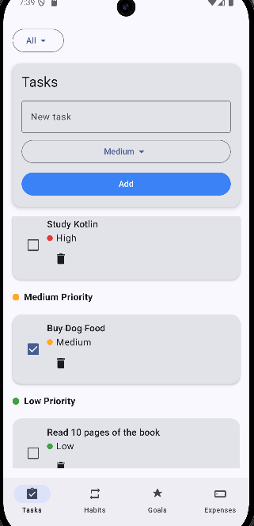
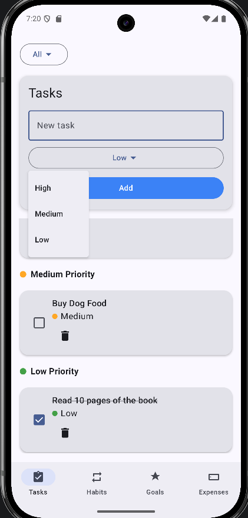
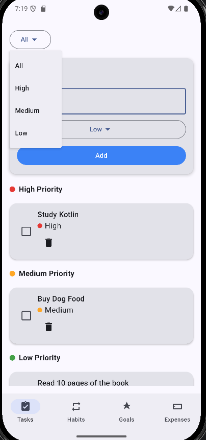
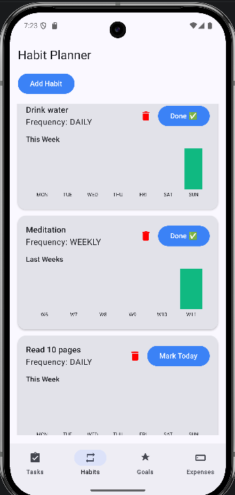
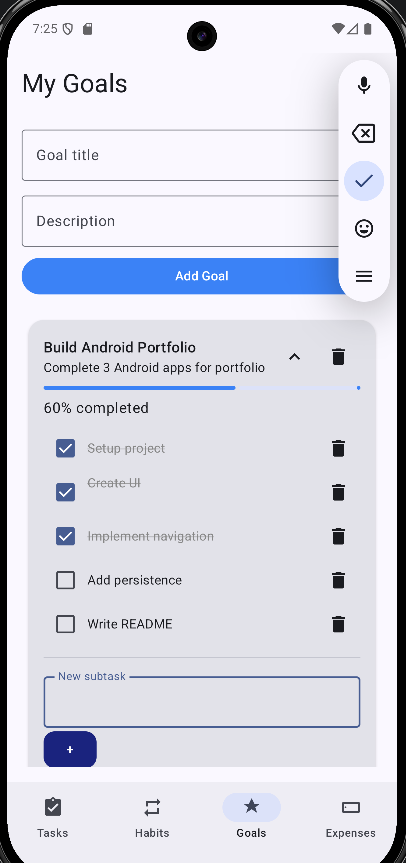
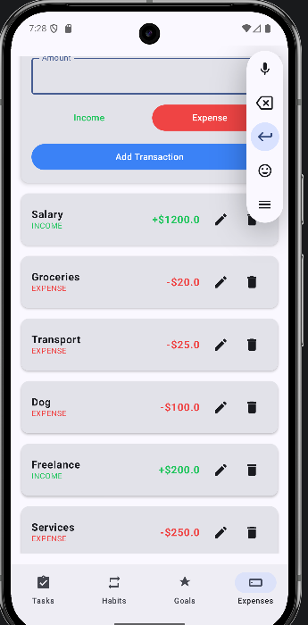
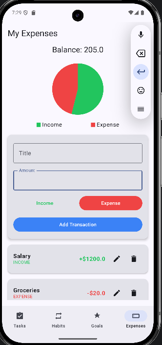

# 📝 MyTasks — Productivity App (Kotlin + Jetpack Compose)

**MyTasks** is an Android productivity application built with **Kotlin and Jetpack Compose**.
The app combines several productivity tools in one place, allowing users to manage tasks, track habits, organize goals, and monitor personal expenses.

---

# 📸 Screenshots

## Tasks





Features shown:

* Create tasks
* Assign priorities
* Filter tasks by priority
* Mark tasks as completed

---

## Habits



Features shown:

* Daily and weekly habits
* Habit completion tracking
* Weekly progress visualization

---

## Goals



Features shown:

* Long-term goal planning
* Subtask management
* Progress tracking

---

## Expenses




Features shown:

* Income and expense tracking
* Balance overview
* Pie chart visualization

---

# ✨ Features

## Task Management

* Add new tasks
* Mark tasks as completed
* Delete tasks
* Priority levels (**Low, Medium, High**)
* Automatic sorting by priority
* Task filtering by priority
* Local persistence using JSON storage

## Habit Planner

* Daily and weekly habits
* Habit completion tracking
* Visual weekly progress charts

## Goals & Objectives

* Create long-term goals
* Add subtasks
* Track goal progress

## Expense Tracker

* Register incomes and expenses
* Automatic balance calculation
* Transaction history
* Pie chart visualization

---

# 🛠 Tech Stack

* **Kotlin**
* **Jetpack Compose**
* **Material 3**
* **MVVM Architecture**
* **ViewModel**
* **StateFlow**
* **Navigation Compose**
* **Kotlinx Serialization**

---

# 🧠 Architecture

The app follows an **MVVM architecture**:

```
UI (Jetpack Compose)
        ↓
ViewModel
        ↓
Repository
        ↓
Local JSON Storage
```

---

# 🚀 Getting Started

### Clone the repository

```
git clone https://github.com/AgostinaDaghero/task-manager-compose.git
cd task-manager-compose
```

### Open in Android Studio

Open the project using **Android Studio (Arctic Fox or newer)**.

### Run the app

Run the application on an **Android emulator or a physical device**.
